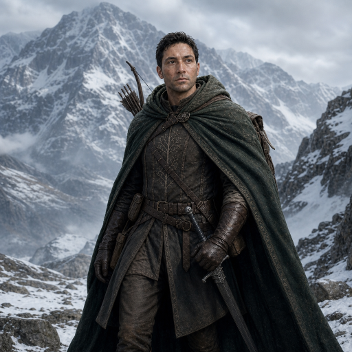

# Limrandir - Ranger

Warden of the trail, Scout of the Dúnedain

"I pledge my eyes to the horizon and my feet to the perilous trail. I swear to remain vigilant for hidden threats, to stand guard at the borders of the free, and to shield the good from the servants of the Enemy. I will range far and chart the lands where other's dare not go."

| | |
| --- | --- |
| **Age** | 38 |
| **Perceived Age (Numenorian Heritage)** | 31 |
| **Race** | Dúnedain. Man of the West |
| **Class** | Ranger/Scout |
| **Homeland** | Shores of Lake Evendim |

## ⚔️ Attributes

| Attribute | Current Score | Title | Progress | Next Level |
| :--- | :--- | :--- | :---: | :--- |
| Endurance (bronwë) | 7050 | Endurance of the Scout | `██████████` | 7100 |
| Strength (Tû) | 45 | Scout of the North Downs | `██████████` | 50 |
| Will (Nîdh) | 405 | Vigor of Annúminas | `██████████` | 410 |
| Constitution (Hûn) | 24.5 | Warden of the North Downs | `██████████` | 26 |
| Spirit (Sûl) | 53.9 | Breath of Elendil | `███████░░░` | 55 |

## 🛡️ Equipment

- Longsword of the Northern Watch
- Shortbow of the Evendim Trails
- Ancient Atlas of Middle-earth (Elven vellum, pre-Beleriand maps)
- Grey Company Cloak

## 🌄 Backstory

### Origins in Evendim

I was born to the fading bloodline of the Dúnedain in the lonely wilds of Eriador. While my brothers mastered the sword, I was drawn to the remnants of our lost kingdom. I spent my youth charting the crumbling ruins of Annúminas and the shores of Lake Evendim. Though thirty-eight winters have passed over me, the pure blood of Númenor runs thick in my veins; I still bear the unlined face and vigor of a younger man. It was at one of our hidden outposts in Evendim that my life changed. Chieftain Aragorn visited our camp and scrutinized my hand-drawn maps. Recognizing my precision, he decreed that my talents belonged in the Last Homely House. He personally arranged for me to be tutored by the Elves.

### The Gift of Rivendell

In Rivendell, the Elven masters opened my eyes to the true art of cartography. I learned to read the ancient topography of Middle-earth, mapping the shifting perils of the Misty Mountains and the forgotten paths of Arthedain. Upon my departure, my Elven instructor bestowed a priceless treasure upon me: an ancient, leatherbound atlas. Its vellum pages hold the geography of Middle-earth from ages past, including detailed maps of Beleriand before it sunk beneath the waves in the First Age. I do not just draw lines on parchment; I weave this deep history into every modern border I track.  

### Counsel to the Grey Company

When the war-shadow lengthened, my unique expertise was called upon by the Grey Company. As they prepared to ride south to aid Aragorn, they sought my knowledge on one of the most perilous regions in lore: the Paths of the Dead. I consulted for our chieftains, combing through ancient Gondorian histories and mapping the dark geography beneath the Dwimorberg. My charts traced the borders of the White Mountains and the territories of the Oathbreakers. I ensured our kin knew exactly what terrors and terrain awaited them.

### The March South

Now, the time for hidden scholarship has passed. I ride south with the Grey Company, my mentor's ancient atlas secured safely against my breastplate. Our path takes us through the haunted, crumbling ruins of Cardolan, crossing the great stone highways built by the Dwarves in ancient days. As we ride toward war, I look at the old roads beneath our hooves and the ancient maps in my pack, ready to guide my kin through the dangers of the wild and into the pages of history.

I utilize a longsword or shortbow in combat and prefer to run rather than ride to keep unseen so our mission may remain secret. I often scout miles ahead on the road south and check for hidden dangers in the trails, testing my ability to run long miles.
